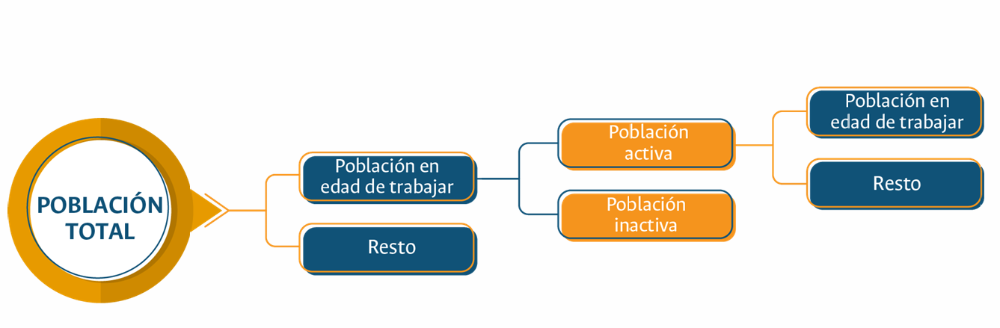
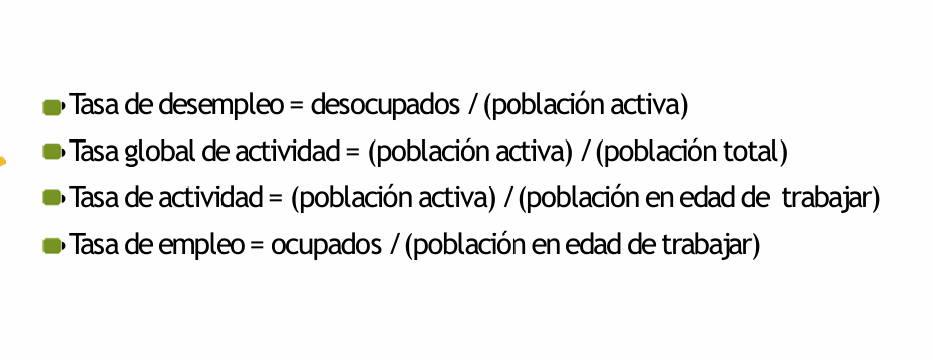

2024-11-23 12:45

Tags: #Finanzas #M1

# Medición Económica

Conjunto de instrumentos cuantitativos y cualitativos para :
* Reducir incertidumbre 
* Diseño de políticas sociales y económicas
* Herramientas de control
# Indicadores Macro-económicos

Herramientas que miden el _rendimiento_ , _salud_ y _estabilidad_ de una economía. Proporcionan información cuantitativa a comprender la situación del momento. 

---
### PIB per capita
Nace de la siguiente relacion :

$$ PIB\, per\,capita  = \frac {PIB}{Poblacion} $$

Medida del ingreso promedio por persona, usado para comparar nivel de riqueza entre diferentes zonas.

---
### Producto interno bruto (PIB)

Valor total de bienes y servicios producidos en un pais durante un periodo especifico. 

Valor monetario a precios del mercado del valor agregado a todos los bienes y servicios transables y no transables al interior de un territorio. 

Se puede medir desde 3 perspectivas:
* _Medida de bienes y servicios finales_  --> En el estado final del producto (Sin productos medios).
* _Suma de valor añadido_ --> Sumando valor añadido en cada etapa de producción.
* _Suma de rentas_ --> Suma de todas las rentas generadas.

A su vez se tiene 2 tipos generales de PIB:

* **Nominal :** Calculado a precios corrientes sin ajustar la inflación.
* **Real :** Ajustado por inflación. 

#### Calculo por Demanda agregada 

$$ PIB = C+G+I+(X-M) $$
	
	C : Consumo --> Representa el gasto de hogares en bienes y servicios finales.
	G : Gasto del Gobierno --> Gasto publico en bienes y servicios. (No incluye transferencias como pensiones o subsidios)
	I : Inversion --> Gasto en bienes de capital, como maquinaria, infraestructura, etc...
	 X : Exportaciones --> Valor de los bienes y servicios nacionales, vendidos al extranjero
	M : Importacions --> Valor de los bienes y servicios internacionales, comprados al extranjero. 
#### Calculo por Oferta agregada 
Se enfoca en el valor producido __Vp__:

$$ PIB = Vp -Ci+T-S $$
	
	Vp : Valor producido --> 
	Ci : Consumo intermedio --> 
	T : Impuestos netos --> 
	S : Subsidios --> 
#### Calculo por distribución de Renta 

$$ PIB = Ebe +RA +T $$
	
	Ebe : Excedente Bruto de explotacion --> Se refiere a beneficios empresariales. 
	Ci : Consumo intermedio --> Rentas de trabajo (Salarios). 
	T : Impuestos netos sobre la produccion -->  

*Balanza comercial* :Mide la relacion entre bienes y servicios que un pais compra y los que vende (__Importaciones y Exportaciones__).  

---

## Medicion del empleo

## Otros indicadores 

