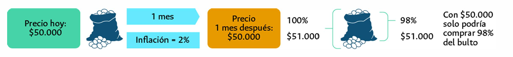

2024-11-23 13:34

Tags: #Finanzas #M1 

# Inflación

Aumento generalizado y sostenido de los precios de bienes y servicios en un tiempo dado.
El calculo viene dado por:

$$ Tasa \,\, Inflacion \% = \frac {IPC_{Actual}-IPC_{Anterior}}{IPC_{Anterior}}*100 $$

Precios suben rápido --> Aumenta la inflación.

* _IPC :_ Mide la evolución del costo promedio de una canasta de bienes y servicios finales, expresado en relacion a un periodo. --> __Variación porcentual del IPC entre 2 periodos representa la inflación en ese lapso__.

---
# Encaje Bancario

**Porcentaje de los depósitos** que los bancos comerciales están obligados a mantener como reservas y no pueden usar para prestar o invertir. Estas reservas se guardan en forma de efectivo o en cuentas en el banco central.

* **Liquidez** : Capacidad de un activo de _rapidamente_ convertirse en dinero en efectivo sin perder su valor. También puede hacer referencia a la cantidad de dinero en una economía para obligaciones inmediatas.

Elementos clave del encaje.
* __Regulación de la liquidez__ : 
	* Encaje alto --> Bancos menos dinero para prestar --> _Menos dinero en circulación_.
	* Encaje Bajo --> Bancos mas dinero para prestar --> _Mas dinero en circulación_
* __Herramienta de protección__: Sirve para proteger a los ahorradores --> _Garantiza dinero para retiros_.
* __Relacion con la política monetaria__: Controlar la cantidad de dinero en la economía --> _Afecta el consumo, el crédito y la inversión_.

---

# Relacion Encaje e Inflación

##### Encaje alto y Control de la inflación
Si el banco central aumenta el encaje --> Los bancos tienen _menos dinero para prestar_ --> Reduce oferta monetaria --> Reduce la inflación.

##### Encaje bajo y estimulación
Si el banco central baja el encaje --> Los bancos pueden _prestar mas dinero_ --> Estimula la inversión y el consumo --> Si es excesivo --> Aumenta la inflación.

---
# Tasa de Cambio

Relación entre 2 monedas, en Colombia se toma como base el _Dólar_. --> TRM (**Tasa representativa del Mercado**) Establece la relación entre el peso colombiano y el dólar.

## Variación de TRM

#### Disminuye si (Dólar mas barato):
* Inversión extranjera.
* Exportaciones
* Crédito externo
#### Aumenta si (Dólar mas caro):
* Inversión en el extranjero.
* Importaciones
* Pago de deudas extranjeras.

---
# Tasa de intervención

Determinan el costo mínimo de los recursos del pais. --> Referencia para la _politica monetaria_.

