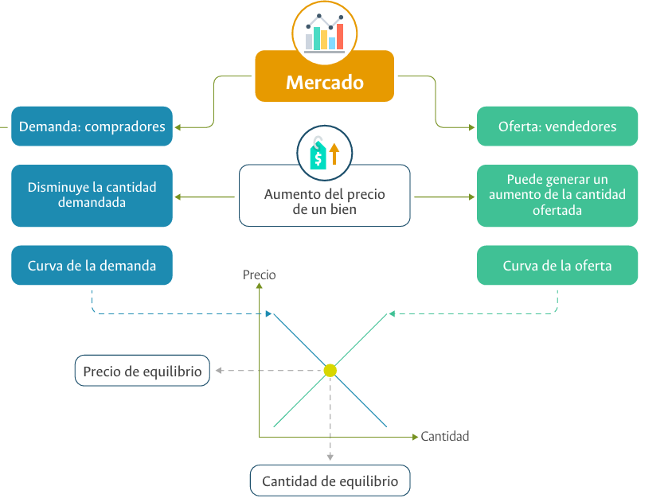

2024-11-23 11:47

Tags: #Finanzas #M1 

# Mercado 

Escenario de negociación entre compradores y vendedores. 

	Monopolio: Unico Vendedor para muchos compradores.
	
Y para el caso contrario se tiene que:

	Monopsodio: Unico comprador para muchos vendedores.

### Oferta y Demanda

## Bienes Relacionados
Bienes que tienen relacion entre el bien inicial y afectan la demanda:
* **Complementarios** : Se consumen en conjunto --> Autos y Gasolina.
* **Sustitutivos** : Bienes que son mutuamente excluyentes --> Te y Café.
Si aumenta el nivel de ingreso del comprador aumenta la demanda.
## Oferta
Entiéndase como los _Vendedores_. Afectado por desarrollos tecnológicos, competencia, etc..
## Demanda

Entiéndase como los _Compradores_. 

Si aumenta el _Precio del bien_ --> **Disminuye la demanda** 
## Curva de la demanda y Oferta

Punto de intersección entre el precio y la cantidad del bien --> _Punto de equilibrio_ --> **Precio del equilibrio** y **Cantidad del equilibrio**. 

Diferentes factores mueven la curva de la demanda y la oferta.

### Elasticidad

Cambio porcentual % entre la cantidad sobre el precio:

Se crean dos posibles casos:

### e > 1 Demanda Elástica (Cantidad > Precio)

Un **cambio en el precio** puede *afectar notablemente* la **cantidad demandada**.

	Linea Horizontal --> Caso extremo

Un **cambio en el precio elimina** toda la demanda de un bien o producto. Solo a un precio constante se tiene valores de demanda.

### e < 1 Demanda Inelástica (Precio > Cantidad)

Un **cambio en el precio** *no afecta notablemente* la **cantidad demandada**.

