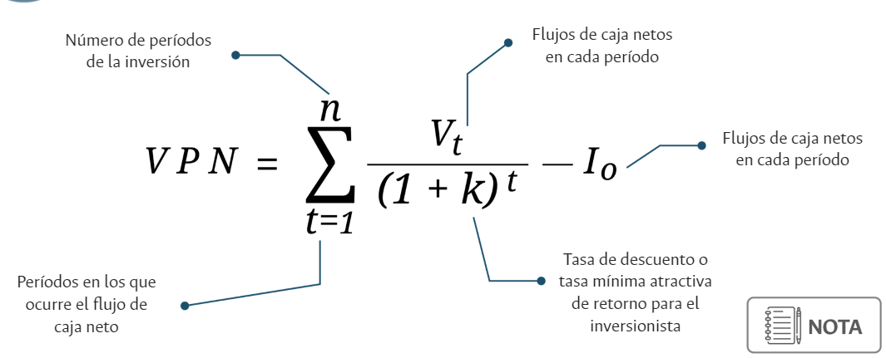

2024-11-23 15:08

Tags: #Finanzas #Ova #M1 

## Valor presente neto (VPN)

Herramienta usada para evaluar si una inversión o proyecto es viable desde el punto de vista financiero. El **Valor Presente Neto (VPN)** es el valor actual de los flujos de caja futuros generados por un proyecto, descontados a una tasa de interés, menos la inversión inicial.

$$ VPN = \sum_{t=1}^{n} \frac{F_t}{(1 + r)^t} - I_{0}$$

	​Ft: Flujo de caja neto en el período ttt.
	r: Tasa de descuento o costo de capital.
	t: Período de tiempo.
	n: Número total de períodos.
	Io​: Inversión inicial.

Se debe tener en cuenta :

* El valor inicial de la inversión.
* Tiempo de ejecución (Horizonte del proyecto).
* Flujos de dinero para el tiempo de ejecución.

Al conocer estos 3 factores, se pueden descontar del flujo de dinero total, obteniendo la _TMAR (tasa mínima atractiva de retorno)_.

### **Interpretación del VPN:**

1. **VPN > 0:**
    
    - El proyecto es viable.
    - Los flujos de caja futuros son suficientes para cubrir la inversión inicial y generar un excedente.
2. **VPN = 0:**
    
    - El proyecto es neutral.
    - Los flujos de caja futuros solo cubren la inversión inicial, sin generar ganancia.
3. **VPN < 0:**
    
    - El proyecto no es viable.
    - Los flujos de caja futuros no son suficientes para recuperar la inversión inicial.

#### Si se asume VPN = 0 (TIR)

Se puede determinar una tasa de rendimiento implícita --> _TIR (Tasa Interna de Retornos)_.  Al despejar para **k** en la ecuación de **VPN**.  Indica rentabilidad de la inversión frente a unos flujos de caja durante la inversión.

 * *TIR :* La tasa a la cual los flujos de caja descontados son iguales  a la inversion inicial. --> Se calcula considerando a los flujos de caja ocurren en __intervalos regulares de tiempo (Debe coiincidir con los intervalos de horizonte)__.    

Por lo que un proyecto será viable si:
* ***TIR > TMAR***

# Relacion TMAR y TD

Cuando k = TIR =TMAR = 0, genera una _TD (tasa de descuento)_ que determina finalmente la viabilidad de un proyecto frente a factores endógenos o exógenos.
