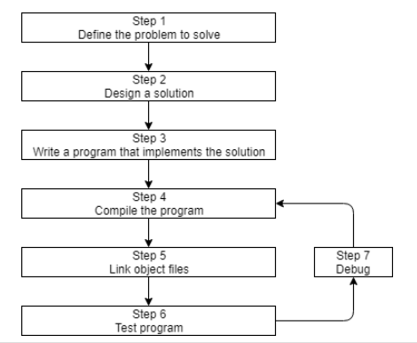
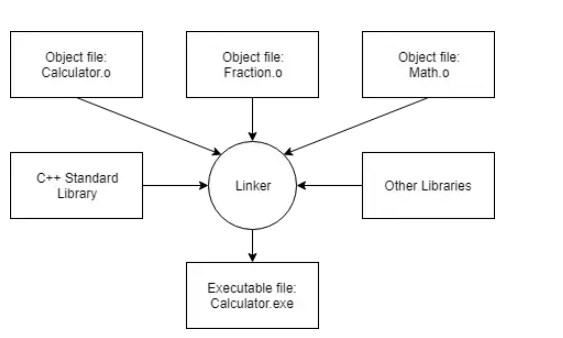

2024-09-28 16:36

Tags: #C

El flujo usual de desarrollo de un programa / proyecto : 




Del _Código_ (.cpp) pasa a compilador que crea un archivo intermedio _Object file_ (.o) para despues producir el _Output_ (.exe) usando un proceso de _Linking_ que conecta las librerias y objetos para generar una salida.

Se incluye de manera predeterminada _C++ Standart Library_ donde viene _Iostream_ que contiene funcionalidades de monitor y teclado.


## IDE C++

Para un IDE propiamente de C++, se tiene estas diferentes opciones para la depuracion y compilacion para casos especificos:
- **Build** compiles all _modified_ code files in the project or workspace/solution, and then links the object files into an executable. If no code files have been modified since the last build, this option does nothing.
- **Clean** removes all cached objects and executables so the next time the project is built, all files will be recompiled and a new executable produced.
- **Rebuild** does a “clean”, followed by a “build”.
- **Compile** recompiles a single code file (regardless of whether it has been cached previously). This option does not invoke the linker or produce an executable.
- **Run/start** executes the executable from a prior build. Some IDEs (e.g. Visual Studio) will invoke a “build” before doing a “run” to ensure you are running the latest version of your code. Otherwise (e.g. Code::Blocks) will just execute the prior executable.
## Statements
	Un tipo de instruccion que causa que el programa realice una accion.
Existen tipos de **Statements**:
- Declaration statements
- Jump statements
- Expression statements
- Compound statements
- Selection statements (conditionals)
- Iteration statements (loops)
- Try blocks
## Functions
	Grupos que contienen statements ejecutados secuencialmente.
Todo programa de _C++_ debera incluir una funcion especial _main_ que es el grupo principal de ejecucion secuencial de _statements_ (El valor devuelto por main debera ser int). 
```cpp
#include <iostream>
int main()
{
//Comentario
int a, b;
int variable = 0;

	std::cout << "Hello, world!";
	return 0;
/* 
Comentario multilinea
*/
return 0;
}
```
# Inicializacion de variables
	Existen 5 tipos de inicializacion de variables.
```cpp
int a;         // default-initialization (no initializer)
// Traditional initialization forms:
int b = 5;     // copy-initialization (initial value after equals sign)
int c ( 6 );   // direct-initialization (initial value in parenthesis)
// Modern initialization forms (preferred):
int d { 7 };   // direct-list initialization (initial value in braces)
int f {};      // value-initialization (empty braces)
```
### Default initialization
Se declara la variable sin asignar valor especifico. Local = indeterminado , Global = 0.
### Copy initialization
Usando _Operador de asignacion_ se permite conversiones de datos implicitas, para el caso de un entero, estaria recortando la parte decimal.
### Direct Initialization
Permite conversion implicita de datos pero es mas eficiente que usando el _Operador de asignacion_.
### Direct-List Initialization
Llamada inicializacion uniforme, no permite conversion implicita de datos, por lo mismo es mas segura y estricta con los tipos de datos.
### Value Initialization
Garantiza que la variable este inicializada a diferencia de la default,  donde si es un objeto de una clase, se volvera el constructor.

La asignacion general de varias variables para cada caso:
```cpp
int a = 5, b = 6;          // copy-initialization
int c( 7 ), d( 8 );        // direct-initialization
int e { 9 }, f { 10 };     // direct-list-initialization
int i {}, j {};            // value-initialization
```

## Atributo "[ [ maybe_unused  ]]"
Los compiladores daran errores al compilar por no usar variables, este atributo hace que el compilador ignore eso:
```cpp
#include <iostream>

int main()
{
    [[maybe_unused]] double pi { 3.14159 };  // Don't complain if pi is unused
    [[maybe_unused]] double gravity { 9.8 }; // Don't complain if gravity is unused
    [[maybe_unused]] double phi { 1.61803 }; // Don't complain if phi is unused

    std::cout << pi << '\n';
    std::cout << phi << '\n';

    // The compiler will no longer warn about gravity not being used

    return 0;
}         // value-initialization
```
