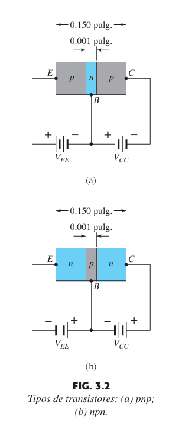
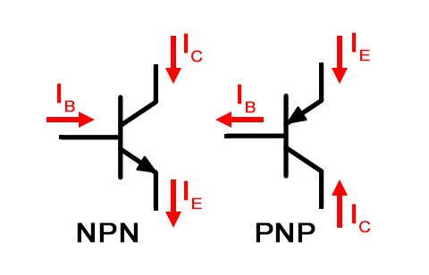
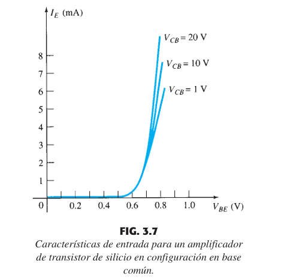
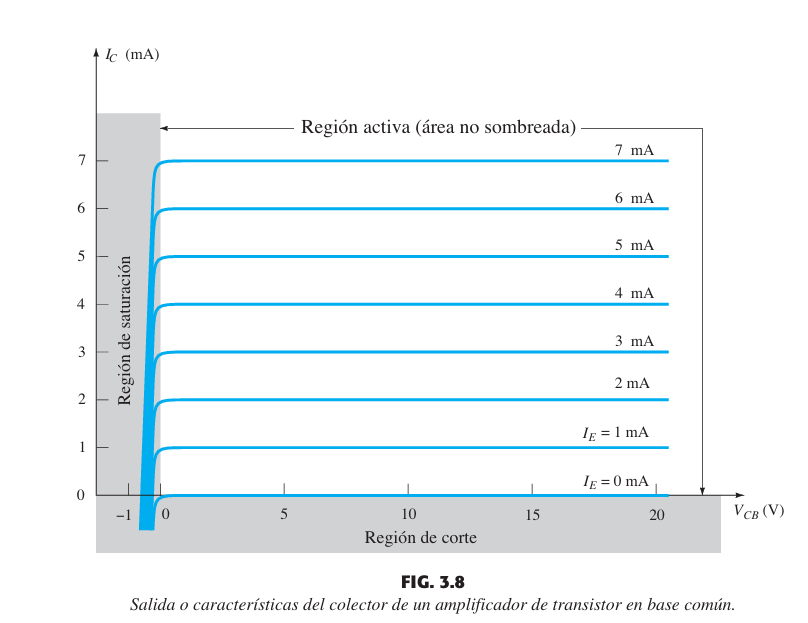

2024-09-30 17:26

Tags: #Analoga #Transistores 

### Estructura 

A su vez su símbolo respectivo:

El cual indica el posicionamiento de un "diodo" creado debido a la juntura semiconductora, cuyo voltaje sigue los mismos principios que el diodo.

### Operación

Siempre se deben de cumplir ciertas ecuaciones sin importar si es _PNP_ O _NPN_:

$$\LARGE I_{E} = I_{B}+I_{C} $$
Entiéndase a Alpha como el factor de ampliación de corriente en emisor comun: 

$$ \large \alpha = \frac {I_{C}}{I_{E}}$$

Entiéndase  a Beta como el factor de ampliación de corriente en base comun.

$$ hfe = \beta = \frac {I_{C}}{I_B}$$

Y las ecuaciones que unen los parámetros:

$$ \alpha = \frac {\beta}{\beta+1} \,\,\,\,\,\,\, \beta = \frac {\alpha}{1-\alpha} $$
### Curvas

### Zona activa

Para comprobar la zona activa (saturación en el caso de los MOSFETS)  se realiza una comparación entre los voltajes para cada caso:

#### PNP

$$ 1)\,V_{E} > V_{B} > V_{C}  \,\,\,\,\,\,\, 2) \, V_{BC} > 0 $$
#### NPN

$$ 1) \, V_{C} > V_{B} > V_{E} 2) \,\,\,\,\,\,\,2)\, V_{CB} > 0 $$