2024-09-30 17:13

Tags: #Transistores #Analoga 

## JFET

Transistor de efecto de campo, que funciona con junturas semiconductoras y un canal que se encuentra _Normalmente abierto_.

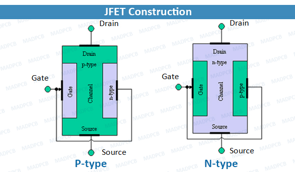

El símbolo usado actualmente se usa para _MOSFET_ también, debido al poco uso comercial del _JFET_.

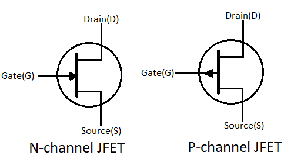

La ecuacion de transferencia es:

$$ \LARGE I_{D}=I_{DSS}(1-\frac{V_{GS}}{V_{P}})^{2}$$ 
Donde los terminos constantes son :
* _Idss_ : Constante que representa la corriente _Id_ en saturacion con _Vgs = 0 V_. 
* _Vp_  = _Vgs(off)_ : Voltaje entre **gate** - **source** , donde la corriente _id  = 0A_.

	*JFET CANAL N* -> -V
	*JFET CANAL P* -> +V

La curva de transferencia entre _Vds - Id_ muestra el punto de valor de _Idss_ y _Vp_ para un _Vgs = 0v_.

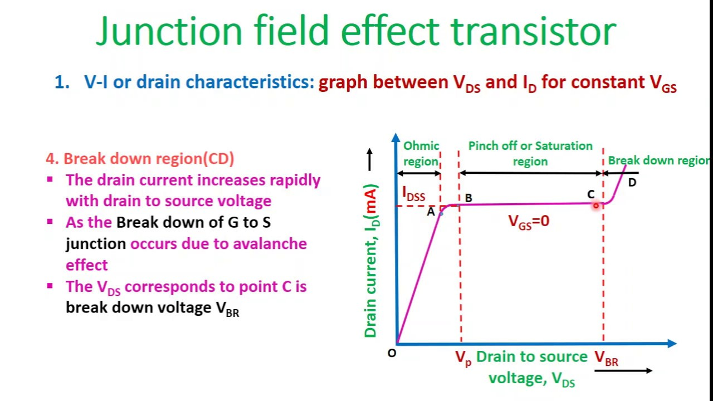

En _Vds = Vp_ se genera estrangulamiento del canal y se entra en saturación. La curva va a variar dependiendo de si es un _N-JFET_ O _P-JFET_:

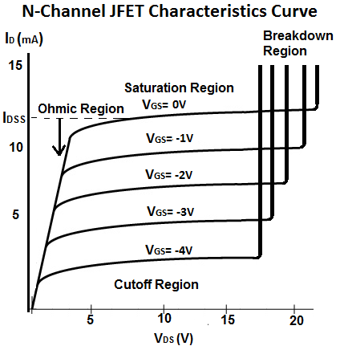

Y la otra curva correspondiente para _N-JFET_:

El punto de operacion ***Q*** se halla con la interseccion lineal de otra ecuacion que representa la relacion entre ambos terminos de forma lineal.

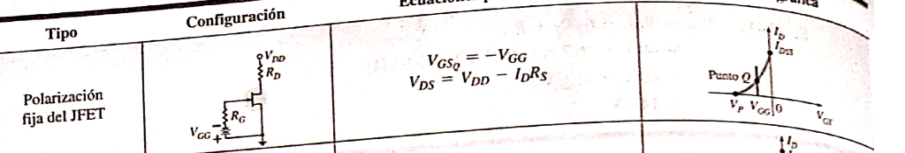

--- 

## MOSFET

Todos los _MOSFETS_ se rigen por la siguiente ecuación:

$$ \Large I_{D} = \frac {K}{2}(|V_{GS}|-|V_{TH}|)^{2} (1+\lambda V_{{DS}})$$

Para cada caso, lo que cambia es la polaridad de _Vgs_ y _Vth_. Por otro lado, la constante **K (Constante del parámetro del MOSFET de transconductancia)** se expresa en  _A / V^2_.

$$ \Large K = \mu _{{n} C_{ox}}$$
Donde:
* _Cox_ = Capacitancia del oxido.
* _un_ = Movilidad de los electrones en la superficie del canal.

A su vez la resistencia _Rds_ esta dada por:

$$\Large R_{DS} = \frac {1}{g_{DS}} $$

Donde _gds_ es la conductancia del canal.
La ecuacion triodo es:

$$ \Large I_{D} = K[(V_{GS}-V_{TH})V_{DS}-\frac {1}{2}V_{DS}^{2}] $$

Sus símbolos correspondientes son:

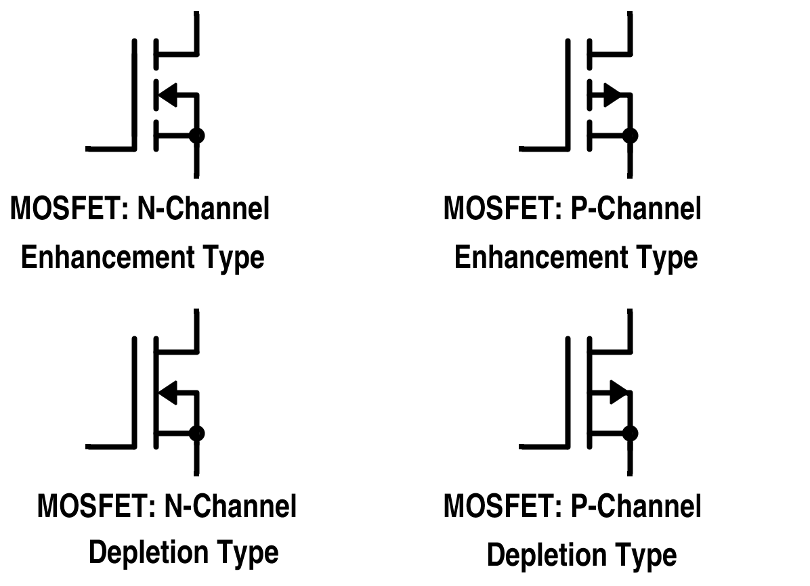

---
### Empobrecimiento (Depletion)

Estos _FETS_ tienen el canal ya creado, al igual que los JFET, por lo que se pueden manejar tanto con las ecuaciones de _MOSFET_ como las de _JFET_, no obstante la ecuación correcta es _Ecuación Del MOSFET_.
#### Curvas

##### Canal P

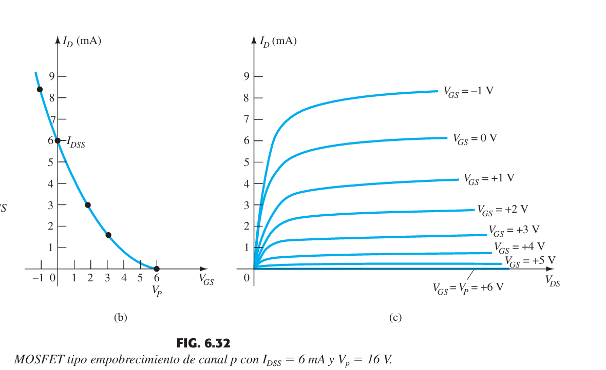
##### Canal N

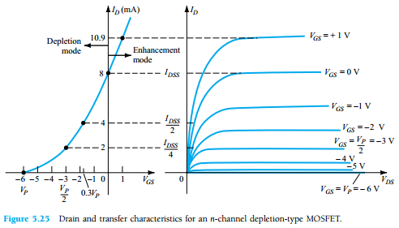

#### Saturación

##### Canal N
Para que entre en saturación el transistor deberá cumplir con las siguientes condiciones:

* **Vgs > 0 > Vth**
* **Vds > Vgs - Vth**

A su vez las polaridades son:

* **Vgs < 0** Cierra el canal .
* **Vgs > 0** Ensancha el canal. 
* **Vth < 0**

La corriente entra por el _drain_ y sale por el _source_ **( D -> S )**, por lo que la ecuación se mantiene igual.
##### Canal P
Para que entre en saturación el transistor deberá cumplir con las siguientes condiciones:

* **Vgs < 0 < Vth**
* **Vds < Vgs - Vth**

A su vez las polaridades son:

* **Vgs < 0** Ensancha el canal
* **Vgs > 0** Cierra el canal
* **Vth > 0**

La corriente entra por el _Source_ y sale por el _Drain_ **( S -> D )**, por lo que si se calcula usando los valores absolutos se obtiene _Is_:

$$ I_{S} = \frac {K}{2}(|V_{GS}|-|V_{TH}|)^{2}$$

---
### Enriquecimiento (Enhancement)

En este caso no hay canal creado.

#### Curvas

##### Canal P

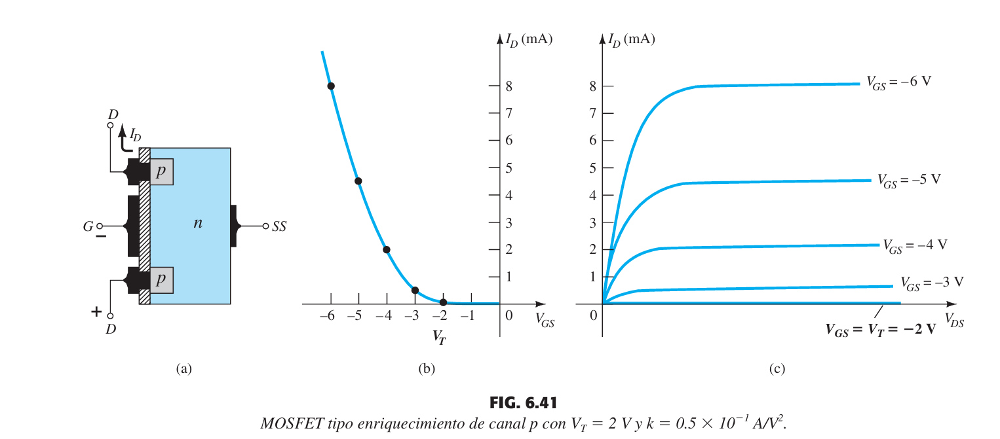
##### Canal N

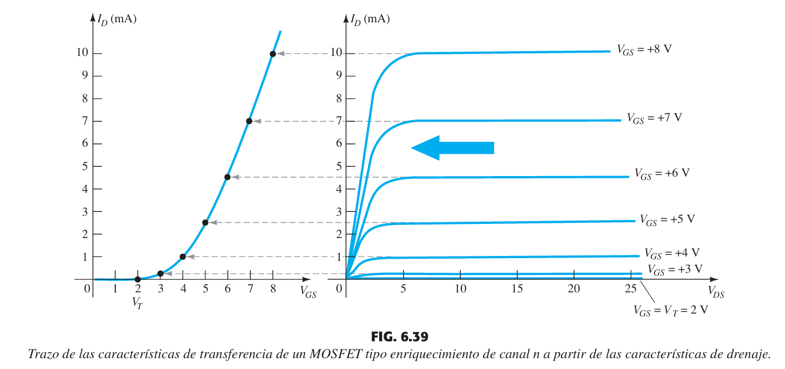
#### Saturación
##### Canal N
Para que entre en saturación el transistor deberá cumplir con las siguientes condiciones:

* **Vgs > 0 > Vth**
* **Vds > Vgs - Vth**

A su vez las polaridades son:

* **Vgs > 0**
* **Vth > 0**

La corriente entra por el _drain_ y sale por el _source_ **( D -> S )**, por lo que la ecuación se mantiene igual.
##### Canal P
Para que entre en saturación el transistor deberá cumplir con las siguientes condiciones:

* **Vgs < 0 < Vth**
* **Vds < Vgs - Vth**

A su vez las polaridades son:

* **Vgs < 0**
* **Vth < 0**

La corriente entra por el _Source_ y sale por el _Drain_ **( S -> D )**, por lo que si se calcula usando los valores absolutos se obtiene _Is_:

$$ I_{S} = \frac {K}{2}(|V_{GS}|-|V_{TH}|)^{2}$$

---
### Efecto de Modulación del canal

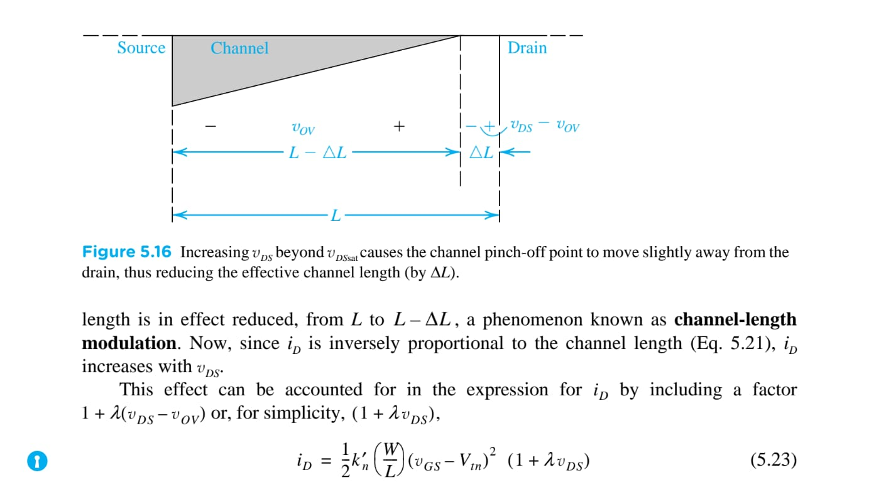

Todo FET tendra asocidado unas variables fijas.
* Rd = Resistencia interna drain - source / source - drain en region triodo y saturacion.
* $\lambda$ = Parametro de modulacion del canal ( _Early_ ). 

$$ \lambda= \frac {1}{V_{A}} $$

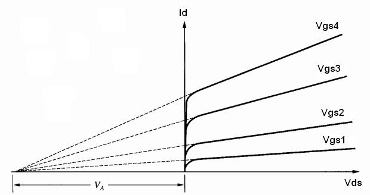

---
### Amplificacion 

Depende del amplificador pero en general:

$$ A = -gmR_{out}$$
A su vez cada topologia (Emisor comun, base comun, etc..) Tiene sus ventajas, por lo que , usualmente se generan amplificadores de varias etapas para poder tener amplificadores mejores.