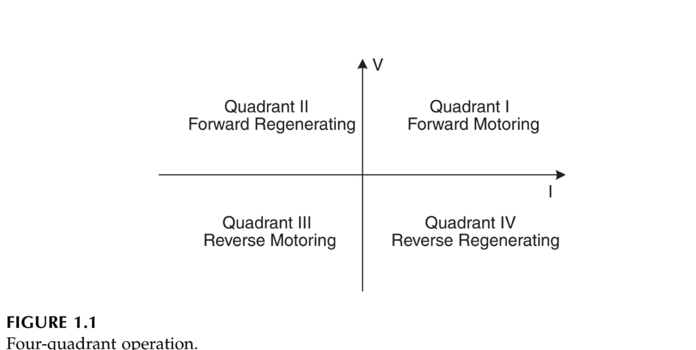
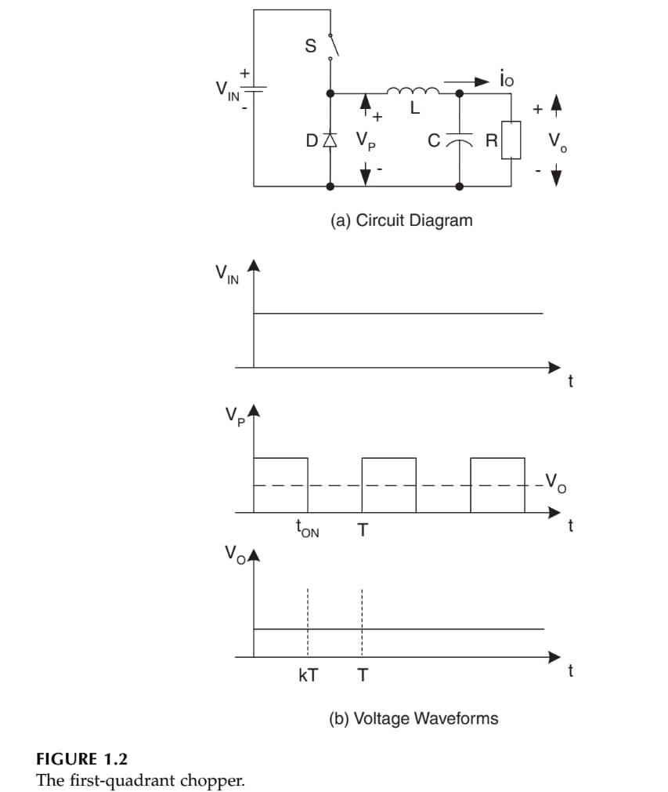
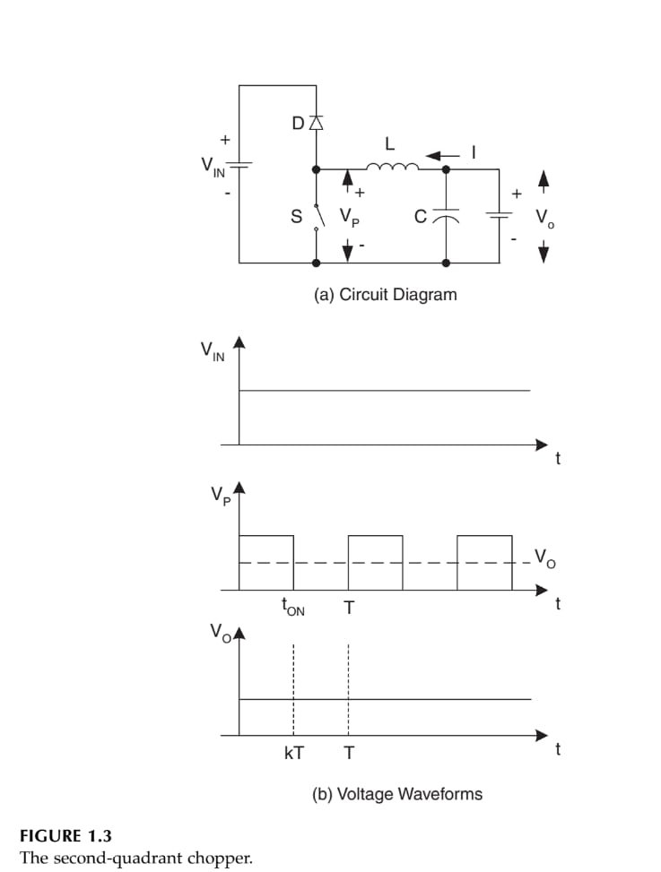
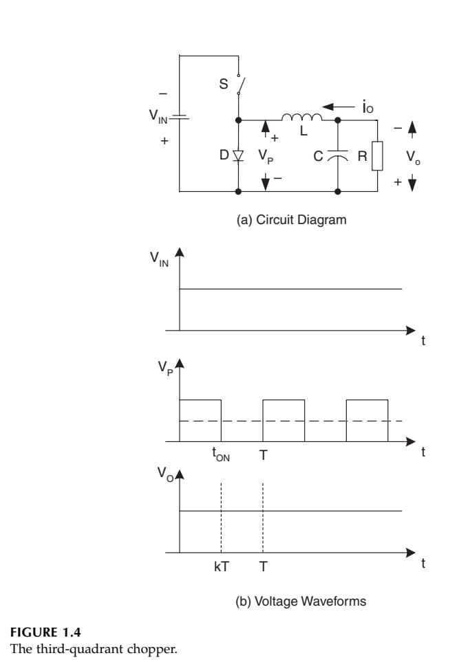
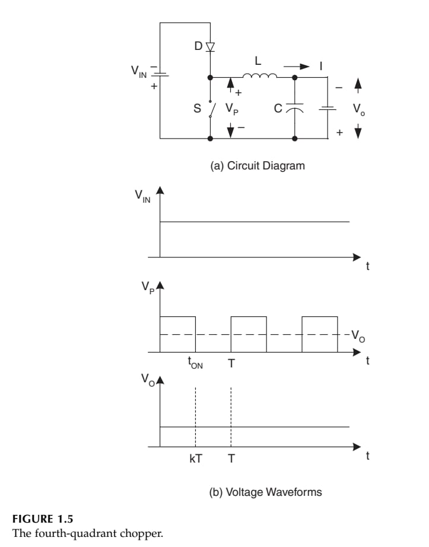
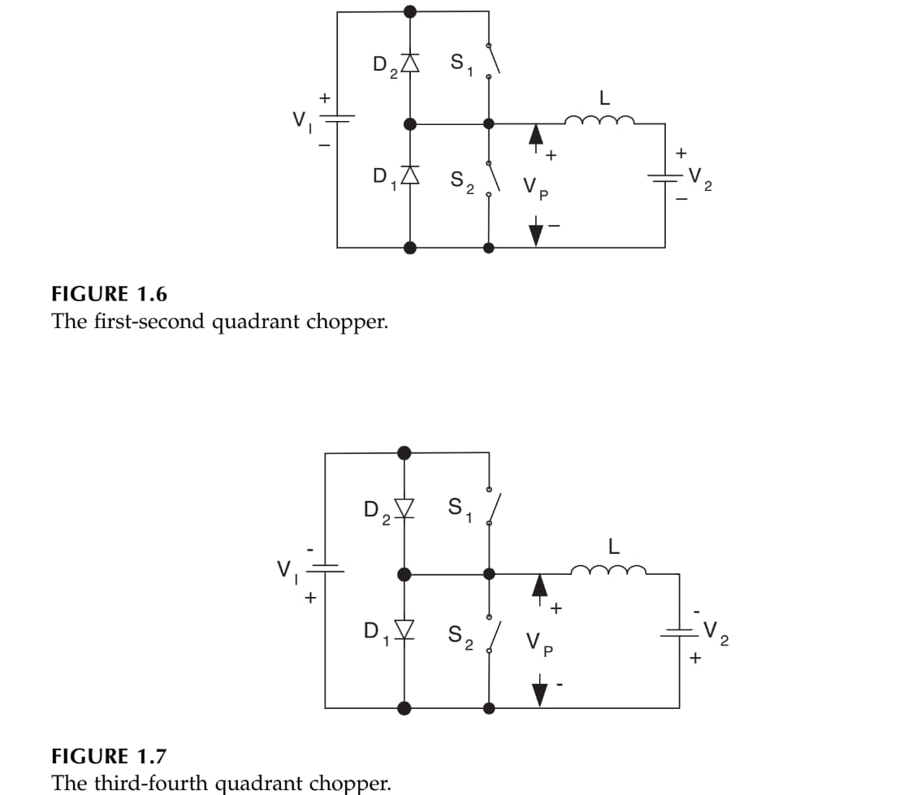
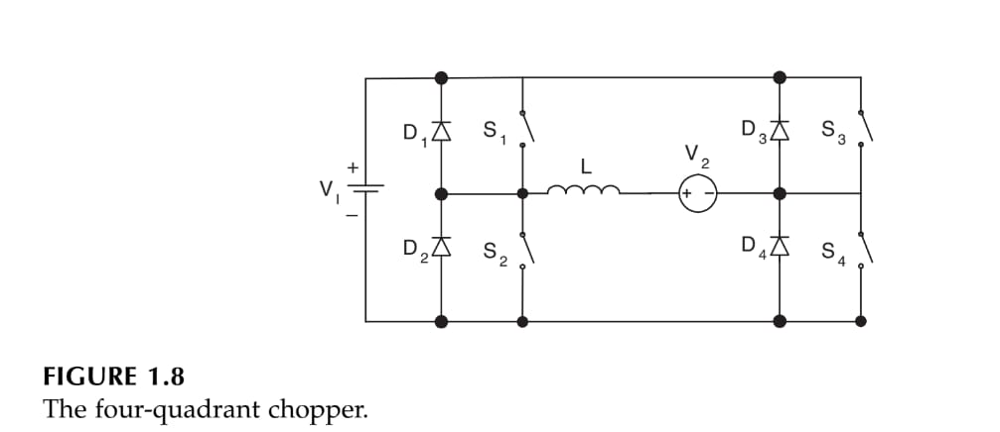

2024-10-08 21:22

Tags: #Potencia #Motor 

Tiene 2 funcionamientos basicos de acuerdo a la direccion de giro.
### Foward Running : 
El voltaje de armadura y corriente son positivas dando giro en la direccion _"Normal"_ (Foward Motoring Operation en el cuadrante **1**). **+V , +A** 

### Foward Bracking:
El voltaje de armadura es positivo pero la corriente es negativa y se frena el motor en su dirección _"Normal"_ (Foward regenerating operation en el cuadrante **2**) **+V , -A**.

### Reverse Starting:
El voltaje de armadura y corriente son negativos dando giro contrario a la direccion _"Normal"_ (Reverse starting en el cuadrante _3_) **-V , -A**.

### Reverse Braking:
El voltaje de armadura es negativo y la corriente es positiva dando giro contrario a la direccion _"Normal"_ (Reverse regenerating Operation en el cuadrante _4_) **-V , +A**.

## Choppers 

Como Interruptor electrónico (Mosfet o IGBT) que regula el flujo de una _fuente de corriente DC_ hacia una carga por medio de su conmutación variando el _Ducy Cycle DT_ y _frecuencia_ (varia la energía que pasa a la carga). 

El resultado en realidad es una onda cuadrada de _Vin_ a _0_ cuyo voltaje promedio es un nivel _DC_ menor a la entrada, no obstante, se usa un filtrado _LC_ que suaviza finalmente la onda (El inductor suaviza la corriente y el capacitor el voltaje). Si la carga es un _Motor DC_ entonces varia la velocidad del motor ***(Modulación por ancho de pulso PWM)***.

### Tipos de Choppers:
Dependiendo del cuadrante donde trabaje se le asigna un nombre. Para cada caso, el switch _S_ se refiere a cualquier elemento de interruptor electrónico.
#### First Quadrant 1 type A
Esquema del circuito con formas de ondas:

#### Second Quadrant 2 type B
Esquema del circuito con formas de onda:

#### Third Quadrant 3 
Esquema del circuito con formas de onda:

#### Fourth Quadrant 4
Esquema del circuito con formas de onda:

#### Combinaciones
Adicionalmente, se suelen generar combinaciones entre tipos de choppers. 

	Cabe resaltar que V2 representa los terminales de carga a lazo abierto o se usa el modelo de fuente de tension para representar la Fuerza Electromotriz generada por un Motor DC .
##### First and Second Quadrant:
Usualmente para sistemas con 2 voltajes _V1_ ,_V2_ donde se asume que _V1 > V2_ , entonces se genera una función a partes en términos de _V2_  para la operación de cada cuadrante.
##### Third and Fourth Quadrant:
Usualmente para sistemas con 2 voltajes _V1_ ,_V2_ donde se asume que _|V1| > |V2|_ , entonces se genera una función a partes en términos de _V2_  para la operación de cada cuadrante.

##### Four Quatrants :
En este caso la salida de voltaje puede ser tanto positiva como negativa (_+Vo | -Vo_). Se genera una función a partes en términos de _Ve_ para cada cuadrante de la forma (Suponiendo que todos los elementos son ideales): 

$$ V_{2} = 
\left\{ \begin{array}{lcc} kV_{1} & si & Q_{1}
\\ (1-k)V_{1} & si & Q_{2}
\\ -kV_{1} & si & Q_{3}
\\- (1-k)V_{1} & si & Q_{4} \end{array} \right.
$$

El esquemático correspondiente es :

Permite decidir totalmente la polaridad del voltaje _V2_ y su corriente respectiva para una carga cualquiera. 
