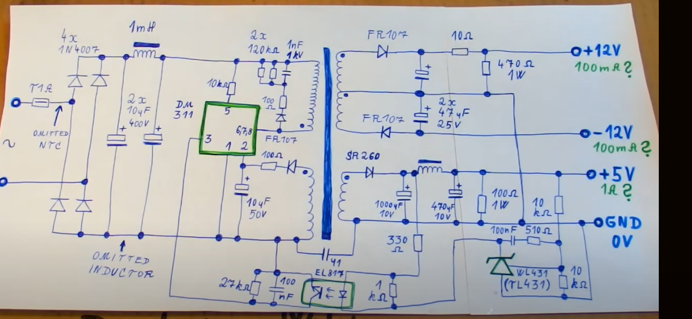

 2024-10-19 16:15

Tags: #Topologia #Potencia 

# Primer Video

### Esquemático

---

# Segundo Video

*  _IC para regulacion y conmutacion:_  LM2587S ->Simple switcher 5A flyback regulator
Para limitar la corriente se realiza un circuito que va hacia el terminal de feedback del IC. Para eso:

---
# Tercer Video

Pasos para diseño Buck simple-> Escoger _IC_: 
* Establecer rango de operacion voltaje entrada
* Determinar voltaje de salida
* Determinar maxima corriente de salida

[DC/DC Converters – Mouser](https://www.mouser.com/c/power/dc-dc-converters/?srsltid=AfmBOorSJ_temlc_aFRMOY-lKa8-2LfH7ot_4R8Su2WBiLWjtNTFclX-)

Pagina para mirar diferentes _IC_.

Despues se necesita hallar la corriente maxima de conmutacion:
* Calcular _Duty Cycle_ 
* Calcular el _rizado de corriente de inductor_
* Comparar con _IC_ seleccionado.
* Calcular picos de corriente.
* Seleccionar inductor de acuerdo a esto.

Revisar datos nominales de los demas elementos.

---
# Cuarto video

Para el flyback se manera es un acomplamiento de inductancias, no como tal un transformador. La diferencia es que se posiciona un diodo de manera que la energia se almacene en el nucleo del transformador.

### Revisar con mas cuidado.

--- 

# Quinto Video

--- 

Este circuito se encarga de convertir una señal DC en una señal AC de alta frecuencia. Despues del filtro capacitivo de un rectificador normal.

Convierte de AC a DC, en este caso.

El transformador tiene un embobinado primario, secundario y uno para el oscilador. Adicionalmente se usa un opto-acomplador para el circuito de feedback.

--- 

_Corriente Eddy:_  Corriente parasitaria de un transformador = Corrientes generadas por un campo magnético externo. Un transformador laminado reduce las perdidas debido a que el núcleo en si no tiene mucho volumen en común como tal.

_Perdidas por Histéresis :_ Perdidas de materiales ferromagnéticos debido a largos ciclos de magnetización y desmagnetización.  Perdidas en calor. Se usan materiales especificos menos suceptibles a este efecto. 
### Diferencias entre Transformador de nucleo laminar y compacto.

* Mas caro si es compacto, para aplicaciones de alta frecuencia.
* Laminar poco util para aplicaciones de alta frecuencia debido a perdidas por histeresis y poca capacidad de respuesta rapida.

### Air Gap

Espacio no magnetico en el nucleo que modifica las caracteristicas del campo magnetico. Ayuda a almacenar energia via campo magnetico. Ventajas generales:

* Evita saturacion del nucleo -> Ocurre cuando se somete el nucleo a un flujo magnetico alto. (Saturacion = No puede aumentar mas su magnetizacion)
* Aumenta reluctancia (Resistencia magnetica) -> Manejo de mas corriente sin saturar el nucleo.
* Reduce permeabilidad.

No obstante, esto aumenta las perdidas por lo que no se usa para transmitir potencia.

