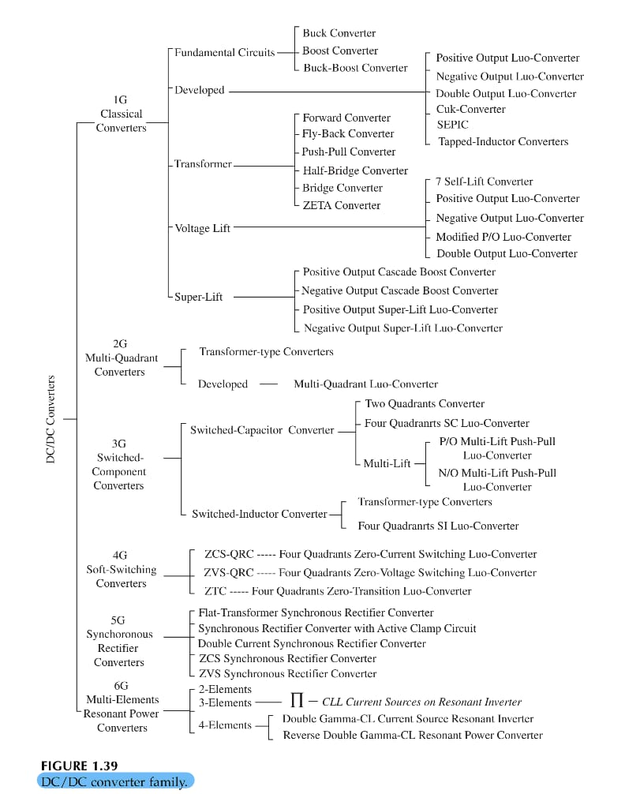

2024-10-17 15:19

Tags: #Topologia #Potencia 

## _Second Generation_

Multiple quadrant operation converters. 

## _Third Generation_

Switched component converters consiste en circuitos de unicamente capacitores, dando asi poco ruido EM.
## _Fourth Generation_

Soft - switching converters:
* Resonant switch converter
* Load Resonant switch converter
* Resonant dc link converter
* Hight Frequency link integral half cycle converter

Donde el efecto de resonancia se trata en general como:
* Zero currente switching (ZCS)
* Zero voltage switching (ZVS)
* Zero transition (ZT)

 Estos convertidores suelen tener 3 estados tipicos; _Over Resonance_ (Completed Resonance) ; _Optimun Resonance_  (Critical Resonance); _Quasi Resonance_ (Sub resonance). El mas comun siendo el ultimo mencionado.

### ZCS-QRC:
Equipa el circuito resonante en la etapa del interruptor para mantener un estado en una condicion (ON / OFF) de cero corriente. (Full wave state y Half Wave state)

### ZVS-QRC:
La misma logica pero en una condicion de voltaje cero.

### ZTC:
Usando ambas topologias anteriores se reduce la perdida de potencia en los switches. Aumenta la eficiencia de conversion.

## _Fifth Generation_

Syncronous rectifier (SR DC/DC). Basado en un bajo voltaje pero alta corriente. Usado en comunicaciones. Active clamped circuit, flat transformers, double current circuit, soft switching methods, multiple current methods.
## _Sixth Generation_

Multiple energy-storage elements resonant converters (MER). Usado en _uninterruptible power supply (UPS)_ ,etc... Se basa en:

* Series resonant converter
* Parellel resonant converter

