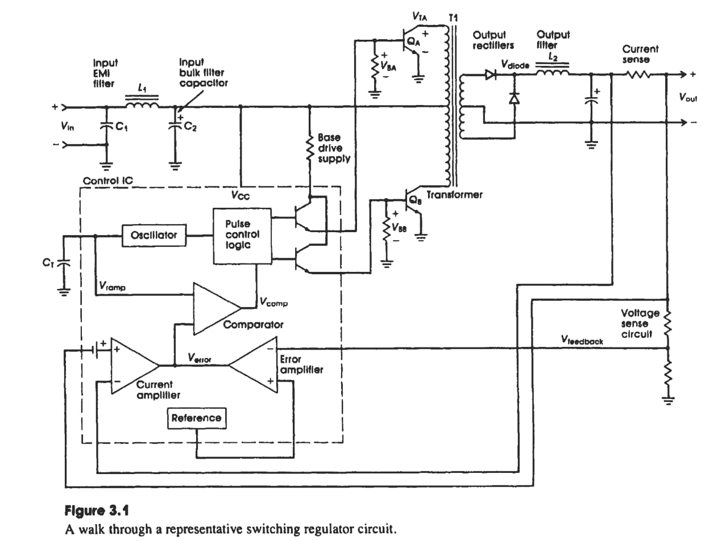
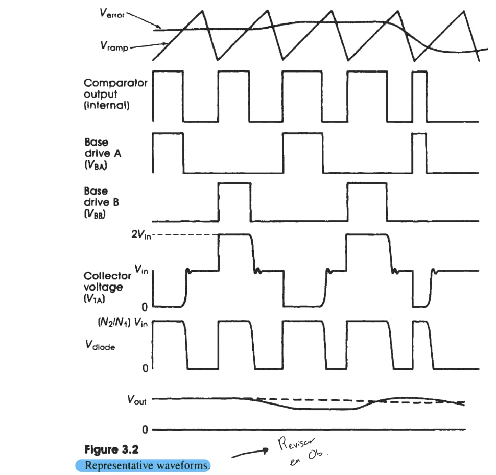

2024-10-15 16:25

Tags: #Potencia #Topologia 

	Filtros _LC_ funcionan como filtros de _HFRFI (High Frecuency Radio Interference)_ . 

La **frecuencia de filtro** no debera ser 2 - 3 veces mas que la frecuencia de la fuente. A su vez, añade una impedancia inductiva entre la fuente y _Bulk filter Capacitor_, lo que reduce transientes peligrosos de corriente y voltaje.

---
### Diagrama general switcheo

---
Por otro lado, el _Bulk filter Capacitor_ se refiere a un elemento con la funcion de almacenar energia de alta - baja frecuencia usada por la fuente en cada ciclo de los transistores. Se conforma usando:

* Capacitor electrolitico para componentes harmonicos de la corriente de _supply's switching frequency_.

* Capacitor ceramico para los harmónicos de la _frecuencia de conmutacion_.

En general:
* Brinda estabilidad al sistema.
* Filtra el rizado y componentes armonicos. 
* Mejor eficiencia.

