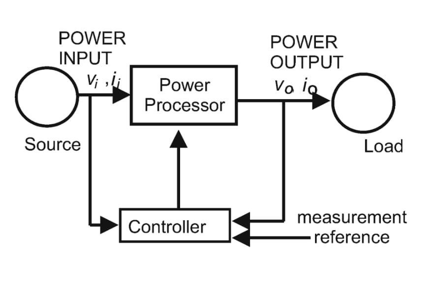

2024-10-03 17:08

Tags: #Potencia 

Los circuitos de potencia existen con el fin de convertir potencia a diferentes formas (AC/DC).
Se divide en 2 módulos primordiales:
* Fase de control _(Control Stage)_ .
* Fase de potencia _(Power Stage)_. 

Se tienen diferentes elementos que se usan para la conexión de ambas fases. 
### BJT
Usado en aplicaciones de baja / media potencia y frecuencia (Poco usado hoy en dia).
### MOSFET
Usado en aplicaciones de _switching_ en baja potencia y alta frecuencia.
### GTO (Gate turn-off Thyristor)
Usado en aplicaciones de media / alta potencia, baja / media frecuencia.
### IGBT (Insulated gate bipolar transistor)
Usado en aplicaciones de baja / media potencia y frecuencia.
### IGCT (Integrated gate commutated thyristor)
Usado en aplicaciones de media / alta potencia, baja / media frecuencia.

* **Convertidor de potencia -> DC**
* **Transformador -> AC**

![[2_Switches PE]]

