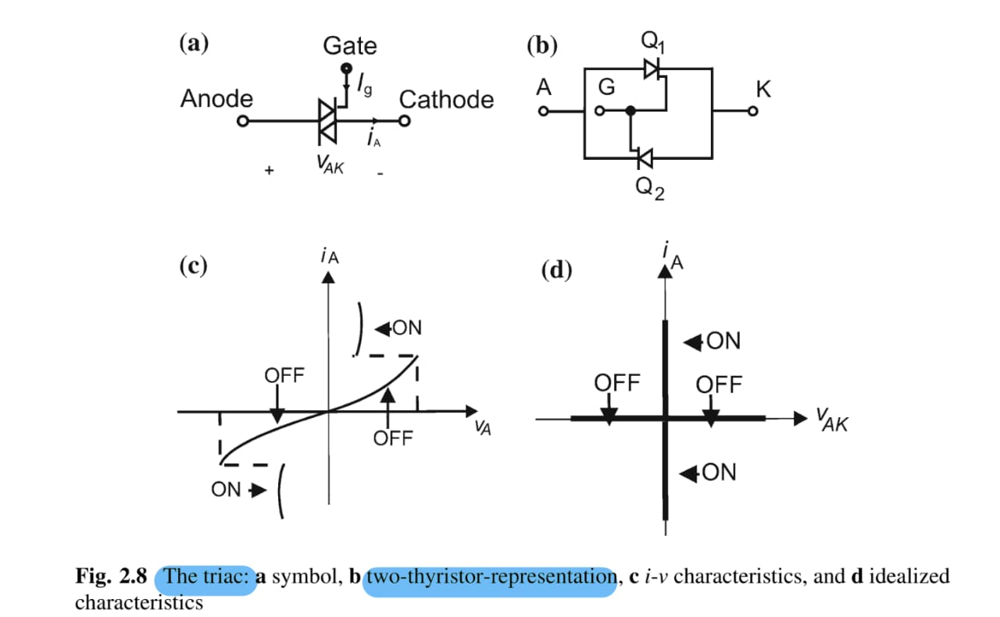
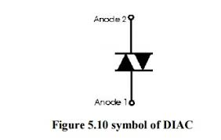

2024-10-03 22:16

Tags: #Thyristor #Potencia #Transistores #PESwitch
 

## Switches PE

Un switch ideal PE se define como un elemento de 3 terminales; _in_ , _out_ y _control_ que tiene un consumo de 0 Watts.

## Tipos de switches

Se asume una tensión  _0 V_ , una corriente de fuga de _0 A_ y un cambio instantáneo de estado. Se clasifican como:
* Uncontrolled switch: Sin terminal de control. _(Diodo)_

* Semi-controlled switch: Con terminal de control pero limitacion en su accionar _(SCR / Thyristor)._
	En el caso de un _Thyristor_ por el terminal de control se puede "prender" permitiendo el paso de corriente (Funcionando como un diodo), no obstante, no se puede apagar sin un circuito adicional. 

		Dispositivo PNPN : Thyristor -> Caso especial SRC, TRIAC, DIAC.
	
	_SRC:_  Simbolo usado para un SRC (silicon controller rectifier) siendo el caso mas básico de Thyristor que es unidireccional como un diodo. Se mantendrá prendido mientras _iA > Holding current (iH)_ siendo independiente de lo que ocurre en el _gate_ . 
	
	
	
	_TRIAC:_ Simbolo usado para un Triac (Triode for AC) modelado como 2 _Thyristors_  haciendo un dispositivo bidireccional de corriente para aplicaciones de baja potencia y fase unica manteniendo encendido mientras que _iA > Holding current (iH)_ siendo independiente de lo que ocurre en el _gate_. 
	
	 

	_DIAC:_ Simbolo usado para un diac (Diode for Alternating Current) cumple la misma funcionalidad de un diodo normal donde al sobrepasar un _Vt (Voltaje Umbral )_.
	
	
	
* Controlled switch: Con terminal de control y control de apagado y cerrado _(BJT , MOSFET , IGBT , GTO THYRISTOR  MCT)_.
* 
	Fundamentado desde elementos con base de _transistor_ o _thyristor_. 
	
	![[Transistores FET (Análoga 1)]]
	![[Transistores BJT (Análoga 1)]]
	
	_IGBT_ : Elemento hibrido donde la parte de control es la del MOSFET y la parte de transmision de energia es la de un BJT. Combina la conmutacion a altas frecuencias del MOSFET con la bjt perdida de potencia del BJT . ( RECOMENDADO)
	
	
	
	Usados para aplicaciones de alta potencia y frecuencia como controladores de motores y generación eólica / hidráulica.
	
	_GTO_: Opera de manera similar a un thyristor con la diferencia en su construcción física que permite el apagado del elemento por medio de una corriente negativa en su compuerta. 
	
	
	
	_MCT (MOS-Controlled Thyristor)_: Elemento hibrido poco usado en la industria que combina MOSFET con Thyristor. 
	