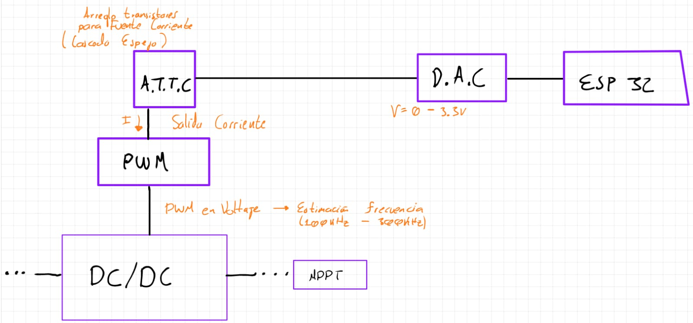
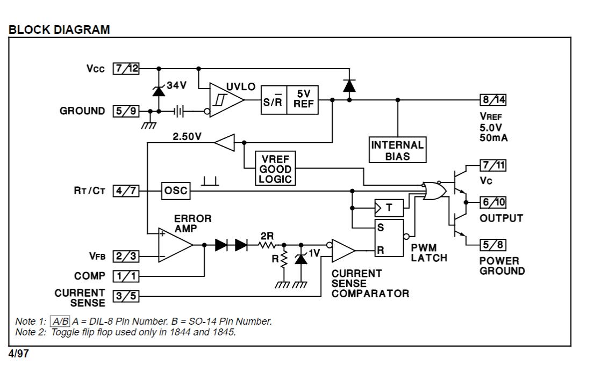

1. Buscar circuitos integrados para _PWM_ y cosas varias 
2. Proto circuito dc/dc
3. Lista de compra

# 1
Se opta por el siguiente diagrama de creación del **DC/DC**:

Se busca un _IC_ que reciba su referencia en forma de corriente --> Producir fuente de corriente --> Arreglo de transistores.

IC PWM seleccionado:
* UC1842 Familia

# 2 

Se obtiene un diagrama básico de **DC/DC** tipo Fly-back (REF v):

Diagrama de bloques del _IC_:

# 3
## Prioridad
1. Compra integrados _PWM_.
2. Compra de arreglos de transistores **AL1106** y/o **1107**
3. Cotización de transformador núcleo compacto con 1 entrada y 2 salidas (tap central)

## Compras day-to-day
1. Capacitores
2. Resistencias
3. Diodos
4. Potenciometros/Trimmers

---
* Se piensa diseñar y ensamblar fuente DC variable (Vmax = 20V y 1A). Es necesario mas no urgente para tener independencia de las fuentes de la universidad a baja potencia (30W max).
* Añadir un pot digital para testeos
* Tener listo los ESP32, no es urgente pero si es un buen rubro
* Comprar el DAC, no es urgente
* Seria util a futuro comprar un ADC, pero no seria para esta fase
* Es prioridad tener los transistores en buena cantidad, como son integrados vienen varios, toca caracterizarlos

