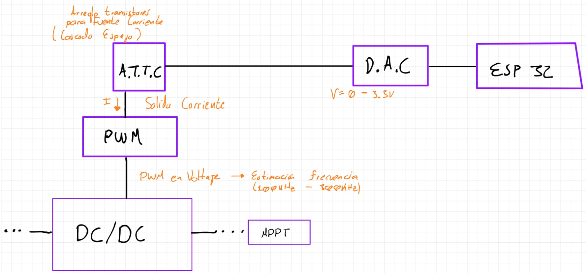
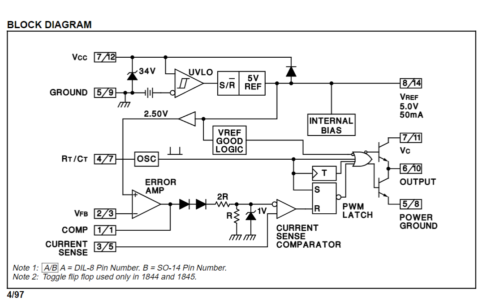

1. Buscar circuitos integrados para _PWM_ y cosas varias 
2. Proto circuito dc/dc
3. Lista de compra

# 1
Se opta por el siguiente diagrama de creación del **DC/DC**:

Se busca un _IC_ que reciba su referencia en forma de corriente --> Producir fuente de corriente --> Arreglo de transistores.

IC PWM seleccionado:
* UC1842 Familia

# 2 

Se obtiene un diagrama básico de **DC/DC** tipo Fly-back:

Diagrama de bloques del _IC_:

# 3
## Prioridad
1. Compra integrados _PWM_.
2. Compra de arreglos de transistores **AL1106** y/o **1107**
3. Cotización de transformador núcleo compacto con 1 entrada y 2 salidas (tap central)
## Compras day-to-day
1. Capacitores
2. Resistencias
3. Diodos
4. 

